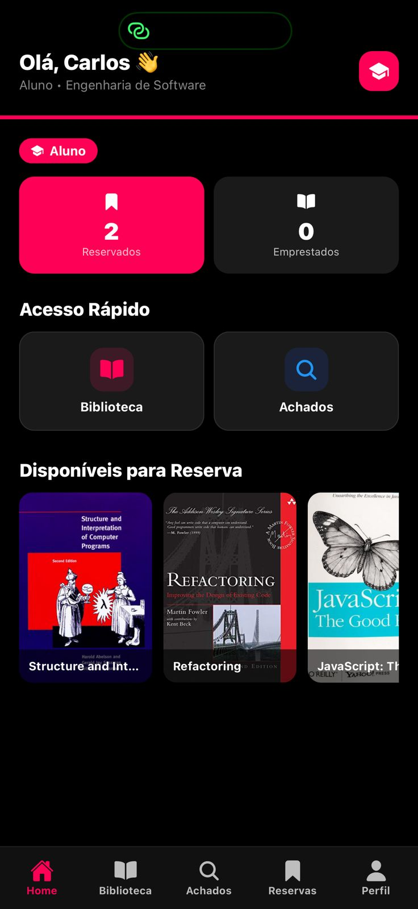
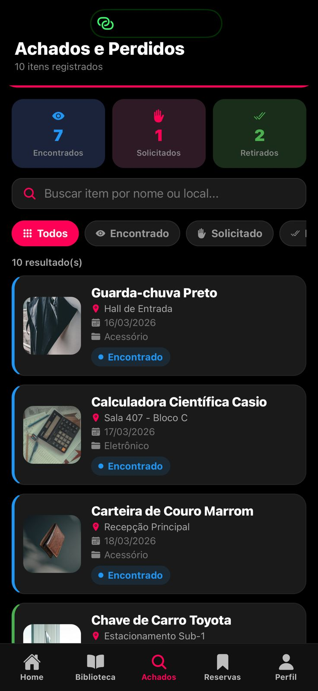
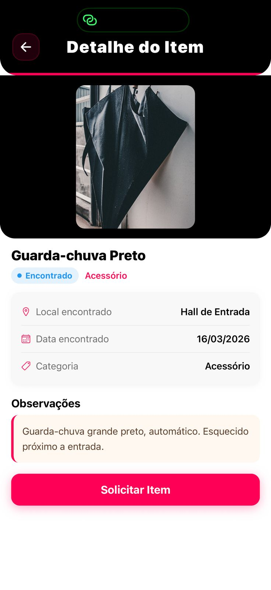
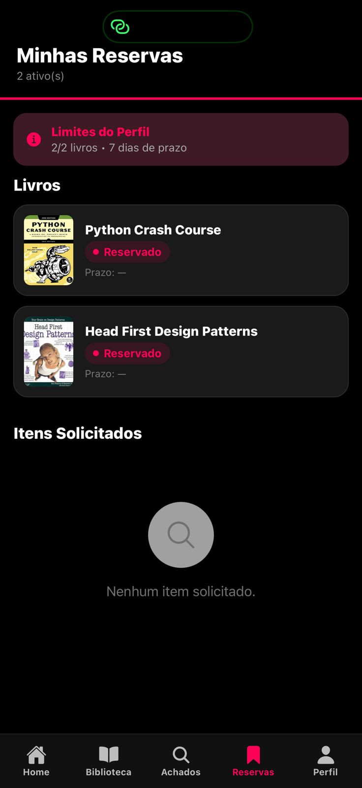
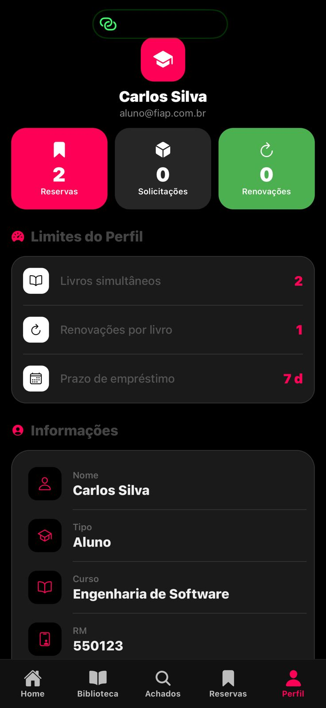
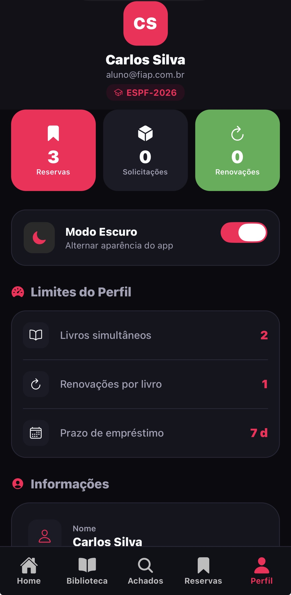
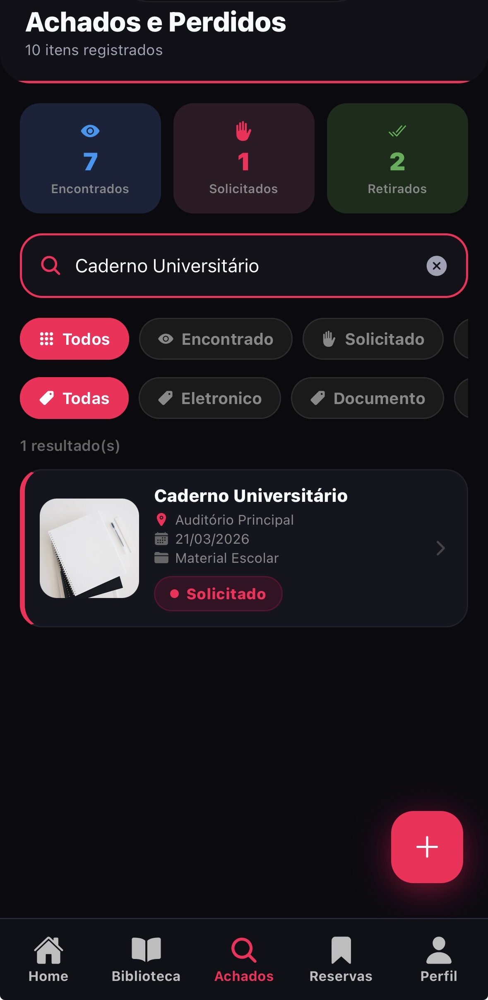

# 📱 FIAP Finder - Aplicativo Mobile

INTEGRANTES ESPF-2026:

- Enzo Dias — RM558225
- Vinicius Henrique — RM556908
- Gustavo Pierre — RM558928
- Gabriel Belo — RM551669
- Laura Souza — RM556320

Um aplicativo completo desenvolvido com **React Native** e **Expo** para ajudar estudantes da FIAP a encontrar livros disponíveis na biblioteca e reportar itens perdidos no campus.

## 🎯 Sobre o Projeto

O **FIAP Finder** é um aplicativo multiplataforma (iOS, Android e Web) que funciona como um intermediário entre estudantes, permitindo:

- 📚 **Buscar livros** disponíveis na biblioteca
- 🔍 **Visualizar detalhes** de cada livro (autor, descrição, capa)
- 📍 **Reportar itens perdidos** no campus
- 🏷️ **Pesquisar itens encontrados** no app
- 👤 **Gerenciar perfil** do usuário
- 📋 **Acompanhar reservas** de livros

### Operação da FIAP escolhida

Escolhemos a **Biblioteca e Achados & Perdidos** da FIAP como foco do aplicativo. A motivação foi resolver duas dores reais dos alunos no dia a dia do campus: a dificuldade em consultar a disponibilidade de livros da biblioteca de forma rápida e a falta de um canal centralizado para reportar e buscar itens perdidos. Unindo essas duas funcionalidades em um único app, o estudante ganha praticidade e o campus ganha organização.

---

## 🚀 Como Instalar e Rodar

### Pré-requisitos

Antes de começar, você precisa ter instalado:

- **Node.js** (versão 16+) - [Download aqui](https://nodejs.org/)
- **npm** (geralmente vem com Node.js)
- **Expo CLI** (instale globalmente)

### Instalação Rápida

```bash
# 1. Clone o repositório
git clone https://github.com/seu-usuario/fiap-mdi-cp1-fiapFinder.git

# 2. Entre na pasta do projeto
cd fiap-mdi-cp1-fiapFinder

# 3. Instale todas as dependências
npm install

# 4. Instale o Expo CLI globalmente (se não tiver)
npm install -g expo-cli
```

✅ Pronto! Agora você está dentro da pasta e pode rodar os comandos abaixo.

### Rodando o Aplicativo

Escolha a plataforma desejada:

#### 🌐 Rodar na Web

```bash
npm run web
```

Abre o navegador automaticamente em `http://localhost:19006`

#### 📱 Rodar no Android (Emulador ou Device)

```bash
npm run android
```

Você precisa ter um emulador Android aberto ou um dispositivo conectado

#### 🍎 Rodar no iOS (Emulador ou Device)

```bash
npm run ios
```

Requer macOS e Xcode instalado

#### ▶️ Modo Desenvolvimento

```bash
npm start
```

Abre o Expo Metro Bundle. Use as teclas:

- `a` - Abrir no Android
- `i` - Abrir no iOS
- `w` - Abrir na Web
- `q` - Sair

---

## 📂 Estrutura de Pastas

```
fiap-finder/
├── app/                          # Rotas e telas do aplicativo
│   ├── _layout.jsx              # Layout raiz
│   ├── index.jsx                # Redirecionamento inicial conforme autenticação
│   ├── login.jsx                # Tela de login
│   ├── cadastro.jsx             # Tela de criação de conta
│   ├── aguardando.jsx           # Tela para usuário pendente de aprovação
│   ├── onboarding.jsx           # Tela/fluxo inicial de apresentação
│   ├── (tabs)/                  # Abas principais (navegação por abas)
│   │   ├── _layout.jsx          # Layout do sistema de abas
│   │   ├── index.jsx            # Tela inicial (Home)
│   │   ├── biblioteca.jsx       # Tela de livros/biblioteca
│   │   ├── achados.jsx          # Tela de itens encontrados
│   │   ├── reservas.jsx         # Tela de reservas do usuário
│   │   └── perfil.jsx           # Tela de perfil do usuário
│   ├── item/[id].jsx            # Detalhes de um item perdido
│   └── livro/[id].jsx           # Detalhes de um livro
│
├── components/                   # Componentes React reutilizáveis
│   ├── BookCard.jsx             # Card para exibir livros
│   ├── LostItemCard.jsx         # Card para itens perdidos
│   ├── Header.jsx               # Cabeçalho do app
│   ├── SearchBar.jsx            # Barra de pesquisa
│   ├── PrimaryButton.jsx        # Botão principal (CTA)
│   ├── SecondaryButton.jsx      # Botão secundário
│   ├── StatusBadge.jsx          # Badge de status
│   ├── LoadingState.jsx         # Estado de carregamento
│   └── EmptyState.jsx           # Estado vazio (sem resultados)
│
├── context/                      # Context API para estado global
│   ├── AuthContext.jsx          # Contexto de autenticação
│   ├── LivrosContext.jsx        # Contexto de livros
│   ├── ItensContext.jsx         # Contexto de itens perdidos
│   ├── ThemeContext.jsx         # Tema claro/escuro
│   ├── ToastContext.jsx         # Mensagens visuais de feedback
│   └── FavoritosContext.jsx     # Livros favoritos
│
├── constants/                    # Constantes da aplicação
│   └── colors.js                # Paleta de cores do app
│
├── data/                         # Dados mockados/simulados
│   ├── livros.js                # Lista de livros de exemplo
│   └── itens.js                 # Lista de itens perdidos de exemplo
│
├── utils/                        # Funções utilitárias
│   ├── dateUtils.js             # Funções de manipulação de datas
│   ├── storage.js               # Utilitários de AsyncStorage
│   └── validators.js            # Validações de formulários
│
├── assets/                       # Imagens, ícones e mídia
│   ├── icon.png                 # Ícone do aplicativo
│   ├── splash-icon.png          # Splash screen
│   ├── android-icon-*.png       # Ícones Android
│   └── favicon.png              # Favicon para web
│
├── app.json                      # Configuração do Expo
├── package.json                  # Dependências do projeto
├── package-lock.json            # Lock das versões
└── README.md                     # Este arquivo
```

---

## 🛠️ Dependências Principais

| Dependência                        | Versão   | Propósito                                    |
| ---------------------------------- | -------- | -------------------------------------------- |
| **expo**                           | ~54.0.33 | Framework para desenvolver apps React Native |
| **react**                          | 19.1.0   | Biblioteca de UI (componentes)               |
| **react-native**                   | 0.81.5   | Framework mobile JavaScript                  |
| **expo-router**                    | ~6.0.23  | Sistema de roteamento (navegação)            |
| **react-native-screens**           | ~4.16.0  | Otimiza performance das telas                |
| **react-native-gesture-handler**   | ~2.28.0  | Detecta gestos na tela (swipe, etc)          |
| **expo-vector-icons**              | ~15.0.3  | Biblioteca de ícones                         |
| **expo-font**                      | ~14.0.11 | Carregar fontes customizadas                 |
| **react-native-safe-area-context** | ~5.6.0   | Respeita áreas seguras do device             |

Para ver todas as dependências, abra o arquivo [package.json](package.json).

---

## 🎨 Decisões Técnicas

### Estado Global (Context API)

O app usa **React Context** para gerenciar estado global:

- **AuthContext**: Armazena dados do usuário logado
- **LivrosContext**: Gerencia lista de livros da biblioteca
- **ItensContext**: Gerencia itens perdidos/encontrados

### Navegação

O app usa **Expo Router** para:

- **Navegação em abas** (Home, Biblioteca, Achados, Reservas, Perfil)
- **Stack navigation** para detalhes de livros e itens
- **Deep linking** (links profundos para compartilhar)

### Hooks Utilizados

| Hook                   | Onde é usado                                | Para quê                                                                                  |
| ---------------------- | ------------------------------------------- | ----------------------------------------------------------------------------------------- |
| `useState`             | Todas as telas e contextos                  | Gerenciar estados locais (busca, loading, feedback, dados do formulário de login, modais) |
| `useEffect`            | Telas e `LivrosContext`                     | Simular carregamento inicial, verificar livros atrasados com intervalo automático (60s)   |
| `useRef`               | `login.jsx`                                 | Criar referências para animações (fade-in e slide-up com `Animated.Value`)                |
| `useContext`           | Contextos (via hooks customizados)          | Acessar os contextos globais de autenticação, livros e itens                              |
| `useRouter`            | Telas, `BookCard`, `LostItemCard`, `Header` | Navegar entre telas (detalhes de livros/itens, login/logout, voltar)                      |
| `useLocalSearchParams` | `livro/[id].jsx`, `item/[id].jsx`           | Extrair o parâmetro `id` da URL para carregar detalhes do livro/item                      |
| `createContext`        | Todos os contextos                          | Criar os contextos globais (`AuthContext`, `LivrosContext`, `ItensContext`)               |

**Hooks customizados criados:**

- `useAuth()` — acessa dados do usuário logado e funções `login`/`logout`
- `useLivros()` — acessa lista de livros e funções de reserva, retirada, devolução e renovação
- `useItens()` — acessa itens perdidos/encontrados e funções de solicitação e retirada

### Componentes Principais

1. **BookCard** - Exibe um livro em formato de card
2. **LostItemCard** - Exibe um item perdido
3. **SearchBar** - Busca e filtro
4. **PrimaryButton/SecondaryButton** - Ações principais

---

## 💡 Como Usar o App

### 1️⃣ Tela de Login

- Faça login com suas credenciais
- Primeiro acesso? Use dados de teste (se disponíveis)

### 2️⃣ Home (Inicial)

- Visualize destaques e últimas atualizações
- Acesso rápido às principais funcionalidades

### 3️⃣ Biblioteca

- Busque livros por título, autor ou categoria
- Clique em um livro para ver detalhes
- Faça reserva de livros disponíveis

### 4️⃣ Achados

- Visualize itens perdidos reportados por outros usuários
- Pesquise por tipo de item ou data
- Se encontrou algo, contate o dono

### 5️⃣ Reservas

- Veja seus livros reservados
- Acompanhe o status de cada reserva
- Cancele reservas se necessário

### 6️⃣ Perfil

- Edite suas informações pessoais
- Configure preferências do app
- Logout

---

## 🐛 Desenvolvimento e Debugging

### Usando o Expo DevTools

Quando o app está rodando, aperte:

- `Ctrl + Shift + D` (Windows/Linux)
- `Cmd + Shift + D` (Mac)

Para abrir outras funcionalidades.

### Verificando Erros

Abra o console do navegador (F12) ou o terminal onde rodou `npm start` para ver mensagens de erro.

### Hot Reload

O app recarrega automaticamente quando você salva alterações nos arquivos JavaScript.

---

## 📦 Scripts Disponíveis

Na raiz do projeto, você pode executar:

```bash
npm start          # Inicia o Expo em modo de desenvolvimento
npm run web        # Roda na web (navegador)
npm run android    # Roda no Android
npm run ios        # Roda no iOS
npm install        # Instala todas as dependências
```

---

## 🔧 Variáveis de Ambiente (Futura Implementação)

Para conectar a APIs reais, crie um arquivo `.env` na raiz:

```
REACT_APP_API_BASE_URL=https://api.seu-servidor.com
REACT_APP_AUTH_TOKEN=seu-token
```

**Nota**: Este projeto atualmente usa dados mockados em `/data`.

---

## 📝 Padrões de Código

### Nomes de Componentes

- Componentes sempre com **PascalCase** (ex: `BookCard.jsx`)
- Páginas/Telas também com **PascalCase**

### Nomes de Arquivos

- Contextos: `*Context.jsx`
- Utilitários: `*Utils.js`
- Componentes: `*.jsx`

### Estrutura de Componentes

```javascript
import React from "react";
import { View, Text } from "react-native";

export default function MeuComponente({ prop1, prop2 }) {
  return (
    <View>
      <Text>{prop1}</Text>
    </View>
  );
}
```

---

## 🆘 Troubleshooting

### Erro: "npm not found"

- Node.js não está instalado ou não está no PATH
- [Baixe Node.js aqui](https://nodejs.org/)

### Erro: "Expo CLI not found"

```bash
npm install -g expo-cli
```

### App não recarrega depois de salvar

- Pressione `r` no terminal (hard refresh)
- Ou reinicie com `npm start`

### Erro de dependências

```bash
# Limpe o cache
npm cache clean --force

# Reinstale tudo
rm -r node_modules package-lock.json
npm install
```

### Porta já está em uso

Se receber erro de porta (ex: 19006 está ocupada):

```bash
npm start -- --port 19007
```

---

## 👨‍💻 Contribuindo

Se você vai mexer no código:

1. **Crie uma branch** para sua feature (`git checkout -b feature/NovaFunc`)
2. **Commit suas mudanças** (`git commit -m 'Adiciona nova função'`)
3. **Push para a branch** (`git push origin feature/NovaFunc`)
4. **Abra um Pull Request**

---

## 📚 Recursos Úteis

- [Documentação Expo](https://docs.expo.dev/)
- [React Native Docs](https://reactnative.dev/docs/getting-started)
- [Expo Router Navigation](https://expo.github.io/router)
- [React Context API](https://react.dev/reference/react/useContext)

---

## 📄 Licença

Este projeto é parte do curso FIAP.

---

## ✅ Checklist para Começar

- [ ] Node.js instalado
- [ ] Dependências instaladas (`npm install`)
- [ ] Escolha a plataforma (web, Android ou iOS)
- [ ] Execute `npm run <plataforma>`
- [ ] App aberto? Sucesso! 🎉

---

## 💬 Dúvidas?

Se tiver dúvidas sobre o projeto, verifique:

1. Este README
2. Os comentários no código
3. A documentação oficial do Expo
4. Os exemplos em `/data` para entender a estrutura

---

## 📸 Demonstração

### Prints das Telas

| Tela                 | Screenshot                                        |
| -------------------- | ------------------------------------------------- |
| Login                |                        |
| Home                 |                          |
| Biblioteca           |              |
| Detalhes do Livro    |       |
| Achados e Perdidos   |           |
| Detalhes do Item     |         |
| Reservas             |                  |
| Perfil               |                      |
| Cadastro             |                  |
| Aguardando aprovação |              |
| Perfil do atendente  |  |
| Modo escuro          |            |
| Busca em tempo real  |             |

### Vídeo / GIF do Fluxo Principal

O projeto deve receber um link real de vídeo ou GIF demonstrando o fluxo principal:

1. Cadastro de usuário.
2. Aprovação pelo atendente.
3. Login.
4. Busca de livro em tempo real.
5. Reserva de livro.
6. Registro de item em Achados e Perdidos.
7. Alternância para modo escuro.

> Link do vídeo: https://youtube.com/shorts/f4Br-6eePLo?si=s4DiBB-7aEgyZaj9

---

## 🔮 Próximos Passos

Com mais tempo, o grupo implementaria:

- 🔗 **Integração com API real** — conectar a um backend para persistir dados de livros, itens e usuários
- 🔔 **Notificações push** — avisar quando um livro reservado estiver disponível ou um item perdido for encontrado
- 📷 **Upload de fotos** — permitir enviar fotos dos itens perdidos diretamente pelo app
- 🗺️ **Mapa do campus** — mostrar no mapa onde o item foi encontrado
- 🔐 **Integração com SSO FIAP** — autenticar alunos e professores usando o login institucional da FIAP
- 📊 **Dashboard administrativo** — painel para funcionários gerenciarem estoque da biblioteca

---

**Bom desenvolvimento! 🚀**

---

## Atualização CP2 - Evoluções Implementadas

Esta seção foi acrescentada para documentar as melhorias feitas no Checkpoint 2 sem remover a documentação original do projeto.

### Autenticação Real e Sessão Persistida

Foram adicionadas melhorias no fluxo de autenticação:

- `AuthContext` agora possui `user`, `usuario`, `isAuthenticated`, `loading`, `login()`, `register()` e `logout()`.
- O login valida credenciais reais cadastradas localmente.
- O cadastro cria usuários no AsyncStorage.
- A sessão é salva na chave `@user`.
- A lista de usuários cadastrados é salva na chave `@users`.
- Ao reabrir o app, o usuário continua logado se houver sessão persistida.

Perfis de demonstração disponíveis:

| Perfil    | E-mail                  | Senha    |
| --------- | ----------------------- | -------- |
| Aluno     | `aluno@fiap.com.br`     | `123456` |
| Professor | `professor@fiap.com.br` | `123456` |
| Atendente | `atendente@fiap.com.br` | `123456` |

### Cadastro e Aprovação pelo Atendente

Foi criada a tela:

- `app/cadastro.jsx`

O fluxo de cadastro funciona assim:

1. O usuário preenche nome, e-mail, RM, sala/turma, senha e confirmação de senha.
2. A conta é criada como pendente, com `aprovado: false`.
3. O usuário é direcionado para `app/aguardando.jsx`.
4. O atendente acessa o sistema com o perfil de atendente.
5. No perfil do atendente, ele pode aprovar ou rejeitar contas pendentes.
6. Só depois da aprovação o usuário consegue acessar as abas principais.

Foi removida a ideia de código institucional fixo, porque um código visível no app permitiria que qualquer pessoa acessasse o sistema. A aprovação manual pelo atendente ficou como controle de acesso principal.

### Proteção de Rotas

A proteção foi integrada ao Expo Router:

- `app/_layout.jsx`
- `app/(tabs)/_layout.jsx`
- `app/index.jsx`

Regras atuais:

- Usuário não logado é redirecionado para `/login`.
- Usuário logado e aprovado acessa `(tabs)`.
- Usuário pendente é redirecionado para `/aguardando`.
- Usuário pendente não consegue acessar as tabs diretamente.
- Durante o carregamento da sessão, o app exibe `ActivityIndicator`.

### Persistência de Dados com AsyncStorage

Foram adicionados utilitários em:

- `utils/storage.js`

Funções:

- `loadData(key)`
- `saveData(key, value)`
- `removeData(key)`

Chaves usadas:

| Chave                        | Uso                                                   |
| ---------------------------- | ----------------------------------------------------- |
| `@user`                      | Sessão do usuário logado                              |
| `@users`                     | Usuários cadastrados                                  |
| `@livros`                    | Estado dos livros, reservas, empréstimos e devoluções |
| `@itens`                     | Itens reportados, solicitados e retirados             |
| `@theme`                     | Tema claro/escuro                                     |
| `@favoritos`                 | Livros favoritos                                      |
| `@first_access_seen:<email>` | Controle da mensagem de primeiro acesso               |

Os contextos `LivrosContext` e `ItensContext` agora possuem `loadData()` e `saveData()` e persistem as alterações feitas no app.

### Validação de Formulários

As validações foram centralizadas em:

- `utils/validators.js`

Validações implementadas:

- E-mail obrigatório e válido.
- Senha obrigatória com mínimo de 6 caracteres.
- Confirmação de senha igual à senha.
- Nome obrigatório.
- RM obrigatório com 6 dígitos.
- Sala/turma obrigatória.

Melhorias de UX:

- Erros aparecem abaixo dos campos.
- Erros usam cor vermelha.
- Botões ficam bloqueados quando o formulário está inválido.
- Login e cadastro não usam `Alert.alert()` para validação.
- Inputs foram corrigidos para não perder foco ao digitar.
- No Expo Web, o outline interno padrão dos inputs foi removido.

### UX/UI Aprimorada

Foram adicionados e melhorados:

- `LoadingState`
- `EmptyState`
- `KeyboardAvoidingView`
- Mensagens de erro e sucesso
- Toasts de feedback
- Melhor contraste no modo claro
- Cards e inputs com tema claro/escuro
- Modal de boas-vindas no primeiro acesso

O primeiro acesso é controlado por usuário. Quando uma conta aprovada entra pela primeira vez, a Home mostra uma mensagem de boas-vindas e salva:

```text
@first_access_seen:<email-do-usuario>
```

Assim a mensagem aparece apenas uma vez por conta.

### Diferencial 1 - Busca em Tempo Real

Implementado em:

- `components/SearchBar.jsx`
- `app/(tabs)/biblioteca.jsx`
- `app/(tabs)/achados.jsx`

Regras atendidas:

- A busca filtra enquanto o usuário digita.
- Campo vazio mostra todos os resultados.
- Sem resultado exibe `EmptyState`.
- Não existe botão de busca.

Na Biblioteca, a busca considera:

- Título
- Autor
- Usuário reservado, no painel do atendente

Em Achados e Perdidos, a busca considera:

- Nome do item
- Local encontrado
- Solicitante
- Usuário que reportou o item

### Diferencial 2 - Modo Escuro

Foi criado:

- `context/ThemeContext.jsx`

Funcionalidades:

- Tema claro
- Tema escuro
- Toggle no Perfil
- Persistência em `@theme`
- Background, textos, cards, inputs, bordas, modais e tab bar respondem ao tema
- Contraste do modo claro reforçado para melhorar leitura

### Achados e Perdidos

Melhorias implementadas:

- Usuário pode reportar item encontrado.
- Item reportado é salvo em `@itens`.
- O item salva quem reportou em `reportadoPor`.
- Se o item foi reportado pelo próprio usuário, a lista mostra:

```text
Você reportou este item
```

- No detalhe do item aparece:

```text
Reportado por: Você
```

- O atendente consegue visualizar quem reportou e quem solicitou.
- O atendente confirma a retirada do item.

### Biblioteca e Reservas

Melhorias implementadas:

- Reserva de livros disponíveis.
- Controle de limite por perfil.
- Confirmação de retirada pelo atendente.
- Confirmação de devolução pelo atendente.
- Renovação de empréstimo por aluno/professor.
- Marcação automática de atraso.
- Tela de reservas do usuário.
- Painel de gestão para atendente.
- Favoritos de livros.
- Avaliação local de livros com estrelas.

### Novos Arquivos Criados

- `app/cadastro.jsx`
- `app/aguardando.jsx`
- `app/index.jsx`
- `app/onboarding.jsx`
- `context/ThemeContext.jsx`
- `context/ToastContext.jsx`
- `context/FavoritosContext.jsx`
- `utils/storage.js`
- `utils/validators.js`

### Arquivos Principais Modificados

- `app/_layout.jsx`
- `app/login.jsx`
- `app/(tabs)/index.jsx`
- `app/(tabs)/biblioteca.jsx`
- `app/(tabs)/achados.jsx`
- `app/(tabs)/reservas.jsx`
- `app/(tabs)/perfil.jsx`
- `app/livro/[id].jsx`
- `app/item/[id].jsx`
- `context/AuthContext.jsx`
- `context/LivrosContext.jsx`
- `context/ItensContext.jsx`
- `components/SearchBar.jsx`
- `components/BookCard.jsx`
- `components/EmptyState.jsx`
- `components/LoadingState.jsx`
- `components/Header.jsx`
- `utils/history.js`

### Evoluções Extras do Sistema

Além dos requisitos principais, foram acrescentadas melhorias para deixar o app com mais cara de sistema real:

- **Dashboard do atendente na Home:** mostra usuários pendentes, livros reservados, itens aguardando retirada e devoluções pendentes.
- **Histórico de ações:** registra aprovações, rejeições, reservas, renovações, retiradas, devoluções e itens reportados em `@history`.
- **Filtros avançados:** Biblioteca filtra por status e categoria; Achados e Perdidos filtra por status e categoria.
- **Confirmações antes de ações importantes:** reserva, renovação, retirada, devolução, rejeição de usuário e reset de demo usam confirmação visual.
- **Onboarding completo:** apresenta biblioteca, achados e perdidos, reservas, perfis/aprovação e modo escuro.
- **Validação visual mais forte:** cadastro mostra força da senha e mantém bloqueio de RM com 6 números.
- **Separação por perfil:** aluno/professor focam em reservas, favoritos e itens; atendente visualiza dashboard, aprovações, retiradas, devoluções e gestão.

### Melhorias Finais para Apresentação

Foram acrescentados ajustes finais para deixar o fluxo mais claro e testável:

- A aprovação de usuários fica em destaque no topo do perfil do atendente.
- A seção de aprovação explica que contas pendentes não acessam o app até serem liberadas.
- O perfil do atendente possui o botão **Resetar demo**, usado para limpar dados locais e testar cadastro, aprovação, reservas e itens desde o zero.
- O reset limpa `@user`, `@users`, `@livros`, `@itens`, `@favoritos`, `@theme` e chaves `@first_access_seen:<email>`.
- Cadastro com e-mail duplicado mostra erro direto no campo de e-mail.
- Ações importantes exibem confirmação visual, como usuário aprovado, reserva realizada, item reportado e tema alterado.
- O bloqueio de usuário pendente também acontece dentro do layout das tabs, impedindo acesso mesmo por rota manual.

### Checklist CP2

- [x] Login real
- [x] Cadastro de usuário
- [x] Sessão persistida em `@user`
- [x] `login()`, `register()` e `logout()`
- [x] Aprovação pelo atendente
- [x] Seção clara de aprovação no perfil do atendente
- [x] Proteção de rotas
- [x] Bloqueio real de usuário pendente nas tabs
- [x] Persistência de livros
- [x] Persistência de itens
- [x] `loadData()` e `saveData()`
- [x] Validação de formulários
- [x] Tratamento de e-mail duplicado no cadastro
- [x] Mensagens de erro e sucesso
- [x] Toasts de confirmação após ações
- [x] EmptyState
- [x] Loading
- [x] KeyboardAvoidingView
- [x] Busca em tempo real
- [x] Modo escuro
- [x] Tema persistido em `@theme`
- [x] Primeiro acesso com boas-vindas
- [x] Itens reportados identificam o próprio usuário
- [x] Botão de resetar dados da demo para apresentação
- [x] Dashboard do atendente
- [x] Histórico de ações em `@history`
- [x] Filtros avançados por status e categoria
- [x] Confirmações antes de ações importantes
- [x] Onboarding completo
- [x] Força da senha no cadastro
- [x] Melhor separação por perfil

### Validação de Build

O projeto foi validado com:

```bash
npx expo export --platform web
```

Resultado: exportação concluída sem erros.
